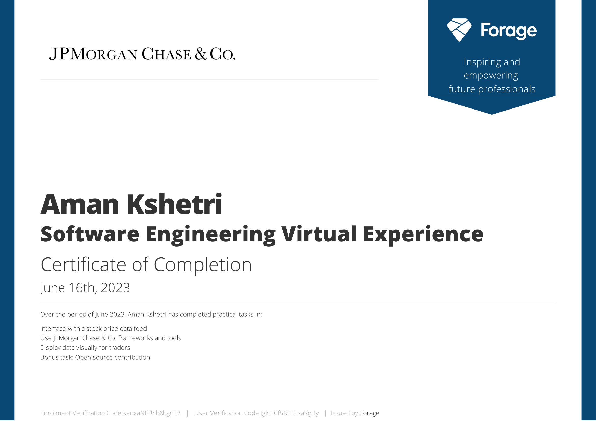

# JPMorgan Chase & Co. Software Engineering Virtual Internship
This repository contains all the submitted patch files of the various tasks assigned by the JPMorgan Chase & Co. Software Engineering Virtual Internship program.

---
## I have worked on the following tasks during the internship
#### TASK 1 : Interface with a stock price data feed
- `Financial Data` `Python3` `Git` `Basic Programming`

#### TASK 2 : Use JPMorgan Chase frameworks and tools
Implement the perspective open source code in preparation for data visualization 
- `React js` `TypeScript` `Web Applications`

#### TASK 3 : Display data visually for traders
Use Perspective to create the chart for the trader's dashboard  
- `Technical Communications` `Financial Analysis` `Web Applications`
---
#### Certificate of Completion

